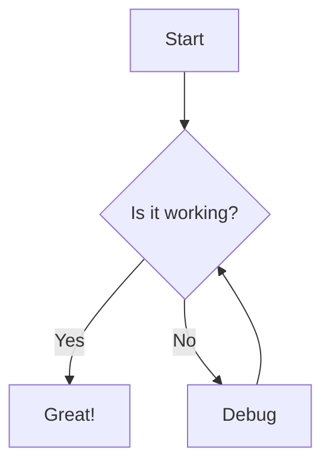
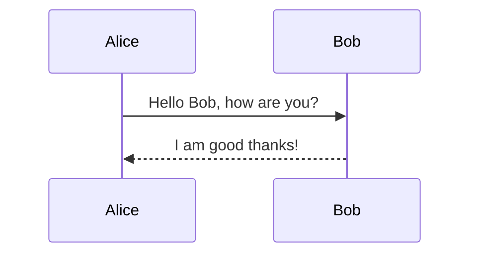
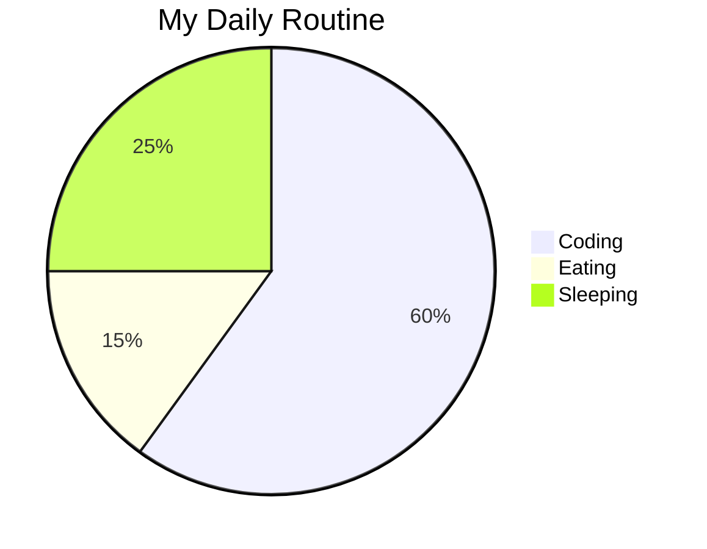

# The Ultimate Markdown Guide 🚀

This document is a comprehensive demonstration of **every possible Markdown feature** supported by this application, including standard syntax, GitHub Flavored Markdown (GFM), and advanced extensions like **Math (LaTeX)**, **Mermaid Diagrams**, and **GitHub Alerts**.

---

## 1. Headers & Typography

# H1 Heading

## H2 Heading

### H3 Heading

#### H4 Heading

##### H5 Heading

###### H6 Heading

**Bold Text**, _Italic Text_, **_Bold & Italic_**, ~~Strikethrough~~, and `Inline Code`.

Subscript: H<sub>2</sub>O
Superscript: X<sup>2</sup>
Keyboard: Press <kbd>Ctrl</kbd> + <kbd>S</kbd> to save.

---

## 2. Lists & Tasks

### Unordered List

- Item 1
- Item 2
  - Nested Item A
  - Nested Item B
- Item 3

### Ordered List

1. First Step
2. Second Step
   1. Sub-step 2.1
   2. Sub-step 2.2
3. Third Step

### Task List

- [x] Implement Markdown parser
- [x] Add KaTeX support
- [x] Add Mermaid support
- [ ] Write documentation

---

## 3. Links & Media

[Visit Google](https://google.com)


---

## 4. Blockquotes & Alerts

> This is a standard blockquote.
>
> > It can even be nested!

### GitHub Style Alerts

> [!NOTE]
> Highlights information that users should take into account, even when skimming.

> [!TIP]
> Optional information to help a user be more successful.

> [!IMPORTANT]
> Crucial information necessary for users to succeed.

> [!WARNING]
> Critical content demanding immediate user attention due to potential risks.

> [!CAUTION]
> Negative potential consequences of an action.

---

## 5. Code & Syntax Highlighting

### Python

```python
def greet(name):
    print(f"Hello, {name}!")
```

### JavaScript

```javascript
const sum = (a, b) => a + b;
console.log(sum(5, 10));
```

### Diff

```diff
- const oldVersion = true;
+ const newVersion = true;
```

---

## 6. Tables

| Feature | Support | Status |
| :------ | :-----: | -----: |
| GFM     |   Yes   |     ✅ |
| Math    |   Yes   |     ✅ |
| Mermaid |   Yes   |     ✅ |
| Alerts  |   Yes   |     ✅ |

---

## 7. Mathematics (LaTeX)

**Inline Math:** $E = mc^2$

**Block Math:**

$$
\int_{a}^{b} x^2 \,dx = \frac{b^3 - a^3}{3}
$$

$$
\begin{pmatrix}
1 & 0 & 0 \\
0 & 1 & 0 \\
0 & 0 & 1
\end{pmatrix}
$$

---

## 8. Mermaid Diagrams

### Flowchart



### Sequence Diagram



### Pie Chart



---

## 9. Advanced HTML & Colors

<span style="color: #e67e22; font-weight: bold; font-size: 1.2em;">Lively Orange Text</span>

<div style="background: #f5f2ea; padding: 1rem; border-radius: 0.5rem; border: 1px solid #e8e2d5;">
    This is a custom styled box using HTML.
</div>

<details>
<summary>Click to reveal a secret!</summary>
Markdown works <strong>inside</strong> details tags too!
</details>

---

## 10. Footnotes

Here is a footnote reference[^1].

[^1]: This is the footnote content.
